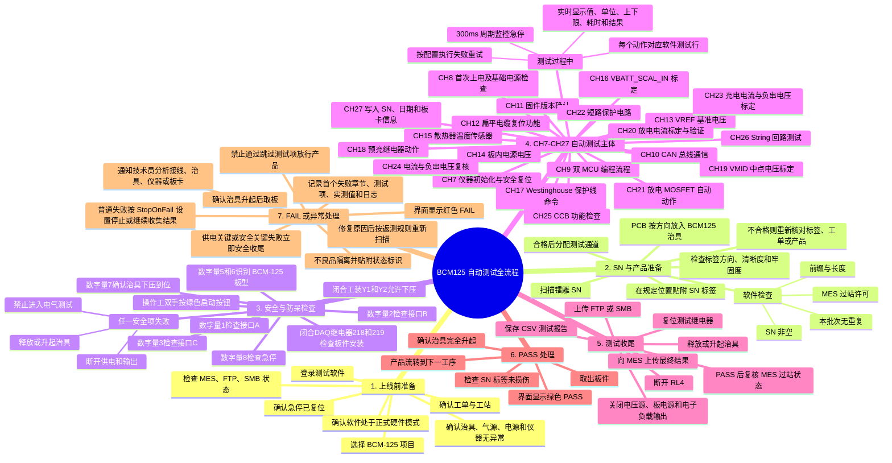
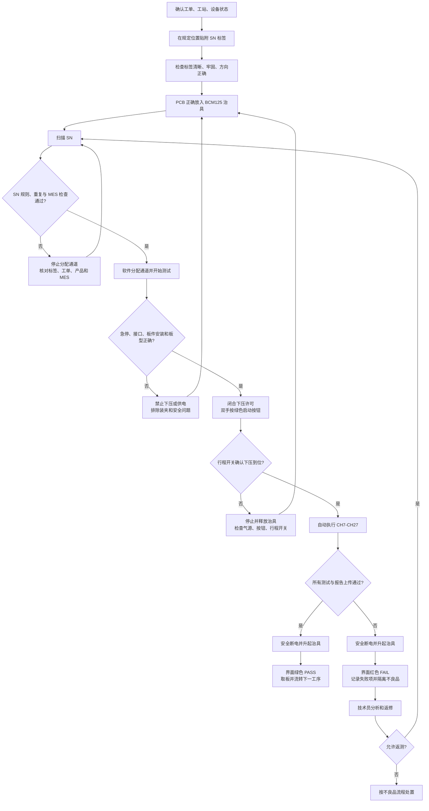

# BCM125 详细测试流程讲解及测试软件展示

> 会议主题：从贴附 SN、扫描 SN、治具安全检查，到 CH7-CH27 自动测试、结果保存和不良品处置。
>
> 依据：`19BU03_119 TESTING PROCEDURE BCM UP125 BOARD rev_5_EN.pdf`、当前 `SKSequences.cs`、`SK441Device.cs` 和 `BCM-125_autoTest.xml`。本文描述的是当前软件流程与操作工视角；正式上机时仍以现场 SOP、安全规范和已确认的仪器接线为准。

## 一、会议用大型思维导图

## 二、操作工实际操作主流程

## 三、从开始测试到结束的讲解

### 1. 上线和贴 SN

操作工先确认当前软件中的工单、工站和产品项目均为 BCM-125，再检查急停、治具、气源、仪器及通信状态。按照生产文件在指定位置贴附 SN 标签，保证标签清晰、方向正确、没有翘边或遮挡测试点。

贴 SN 是人工工艺动作，当前 BCM125 自动测试序列从“扫描并获取 SN”开始，并不控制贴标设备。因此会议演示时应把“贴标检查”明确讲成进入软件流程前的质量关口。

### 2. 放板和扫描 SN

将 PCB 按定位方向放入治具，扫描镭雕 SN。软件会根据配置检查：

- SN 是否为空、前缀和长度是否正确；
- 同一测试批次是否已经扫描过该 SN；
- MES 启用时，该 SN 是否允许在当前工单和工站过站；
- 并行测试时，是否存在可分配的空闲通道。

检查通过后，界面将该 SN 分配到测试通道，通道窗口变为黄色“测试中”。检查失败时不进入本地测试，操作工应核对标签、产品、工单和 MES 信息，不能手工修改结果绕过。

### 3. 安全、防呆和治具下压

软件依次确认急停、接口 A/B/C、板件安装和板型。板件安装检查会闭合 DAQ 继电器 218/219，再读取安装信号；数字量 5/6 必须识别为 BCM-125。随后闭合治具 Y1/Y2 下压许可，提示操作工双手按绿色启动按钮，并等待数字量 7 行程开关闭合。

这些步骤属于安全关键步骤。任一步失败，软件停止向后执行，并尝试关闭供电、关闭仪器输出、释放或升起治具。操作工必须在确认治具完全回到安全位置后才能重新放板。

## 四、CH7-CH27 章节说明

| 章节 | 主要目的 | 自动测试主要做什么 | 失败后如何处理 |
|---|---|---|---|
| CH7 仪器初始化 | 建立安全、可重复的测试初始状态 | 检查各仪器在线；关闭所有仪器输出；断开测试继电器，同时保持治具下压许可 Y1/Y2 | 不给 DUT 上电；检查 COM 配置、仪器电源、USB/RS485 连接和地址，恢复后重新开始 |
| CH8 FIRST START-UP | 确认 DUT 首次上电后的基础电源完整性和静态功耗 | 板电源设为 140 V/1 A，闭合 RL4；测量 +5 V、+VCC、两路 -VEE、两路 3V3 及 VCC/5 V 支路电流 | 属于供电关键故障；立即断开 RL4 并关闭输出，检查短路、极性、电源轨、分流电阻及 DAQ 接线 |
| CH9 PROGRAMMING | 完成 BCM1、BCM2 的 BOOT、RESET 和编程接口切换 | 控制 RLP1-RLP8、DAQ @205/@206 和 W86，分别进入两颗 MCU 的编程状态并退出 | 隔离板件；检查 TTL 路由、BOOT0、RESET、固件文件和编程器连接。当前软件中的真实 TTL 烧录仍为可见的模拟/跳过步骤，正式生产演示前必须说明 |
| CH10 CAN BUS | 验证 DUT 内部 CAN 通信链路 | 对 DUT 重新上电，通过 USB-B/MBD 查询 R14、R15，检查 BCM 与 SAFE 节点响应 | 检查 MBD 串口、RL4 供电、复位时序、CAN_H/CAN_L、终端电阻和节点固件 |
| CH11 FIRMWARE VERSION | 防止错误固件流入后续测试 | 分别 REMOTE1、REMOTE2，读取 R0，核对 BCM1/BCM2 固件版本 | 不允许放行；加载规定固件后重新编程并重新执行版本检查 |
| CH12 RESET FROM FLAT CABLE | 验证扁平电缆复位控制确实作用于两颗 MCU | 读取复位前运行时间，执行 W86 复位，再读取复位后运行时间并比较变化 | 检查扁平电缆、RESET 信号、MBD 命令链路和两颗 MCU 的复位电路 |
| CH13 VREF VOLTAGE | 检查 ADC 基准电压是否正常 | 对 ST1、ST2 读取 R55 的 VREF ADC 值并与范围比较 | 检查基准源、滤波、ADC 引脚、地线和通信返回值 |
| CH14 POWER SUPPLY VOLTAGES | 检查 MCU 监测到的 VCC/VEE 电源值 | 对两路控制器读取 R53、R54，验证 VCC 与 VEE 监测结果 | 检查板内正负电源、分压/采样网络和 ADC 通道；不要仅调整软件阈值掩盖硬件偏差 |
| CH15 HEAT SINK TEMPERATURE | 验证散热器温度传感器和 ADC 通道 | 对 ST1、ST2 读取 R52，检查常温下传感器计数 | 检查温度传感器、焊接、供电、线束和 ADC 输入；温度环境异常时待稳定后再测 |
| CH16 VBATT_SCAL_IN CALIBRATION | 标定正向母线/电池测量通道 | 控制 W94/W91；用 DAQ CH05 测实际母线电压，读取 R51 ADC，计算并写入 W18/W19，写 FLASH 后用 R18/R19、R43 验证 | 立即停止该板的标定放行；检查 140 V 源、RL2/W91、DAQ CH05、ADC 和写 FLASH。140 V 验证范围下限为 137500 mV |
| CH17 WESTINGHOUSE LINE | 验证两路保护线命令和状态反馈 | 使能 MBD W95；对两路执行 W67，并读取 R61/R81 比较命令前后的保护状态 | 检查 U1/U33 相关保护电路、MBD 控制、线束和反馈信号；保护功能异常的板件必须隔离 |
| CH18 PRECHARGE RELAY | 验证预充继电器能按命令吸合和释放 | VBUS 发生器设为 140 V；控制 W75，读取 R69/R68 比较动作前后状态 | 关闭高压；检查预充继电器、线圈驱动、触点、VBUS 输入和状态采样 |
| CH19 VMID CALIBRATION | 标定两路中点电压测量 | 闭合 RL6；将 VBUS/VMID 模拟源设为 62.5 V 和 5 V；R93 与 DAQ CH06/106 各采样 8 次求平均；计算并写入 W20/W21，再用 R20/R21、R92 验证 | 检查电压源 A、RL6、DAQ 106 的 Gen VBUS+ 对 Gen VBUS- 接线、R93 ADC 和写入参数。不得改用 CH05、CH09、CH10 或仅使用设定值替代实测值 |
| CH20 DISCHARGE CURRENT | 标定并验证两路放电电流测量 | String 发生器输出 1 A、6 A；读取 R57 ADC；ST1 用 DAQ 113/CH13 的 V2-V3 分流，ST2 用 DAQ 115/CH15 的 V6-V7 分流换算电流；计算增益和偏移并验证 | 关闭输出；检查 String 源、放电通路、MOSFET、分流电阻、DAQ 极性与通道。不得使用 PDF 旧分流通道 |
| CH21 DISCHARGE MOSFET | 验证达到条件时放电 MOSFET 自动开启 | 构造两路测试条件，读取 R45 电流和 R59 MOSFET/门极状态，确认自动动作 | 检查 MOSFET、驱动、阈值条件、采样电路及散热；异常时禁止继续带载 |
| CH22 SHORT PROTECTION | 验证短路保护检测和状态切换 | 通过夹具 U1.2/U33.2、DAQ @204 在 2.9 V/3.3 V 间切换，并读取 R61/R60 判断两路保护状态 | 立即撤销短路模拟并关闭输出；检查 @202/@203/@204、保护比较器、Westinghouse 状态和夹具接线 |
| CH23 CHARGING/VSTR_NEG CALIBRATION | 标定充电电流和负串电压测量 | 组合 VBUS 1/15 V 与 String 0/6 A；读取 R50/R56、DAQ CH09/CH10 和 CH13/CH15；分别计算并写入 gain/offset，写 FLASH | 检查源、分流、DAQ 极性、ADC 和 FLASH。Q12-Q16、Q28-Q32 是 10 个独立结果，任何一项失败都应单独记录，不能用聚合字符串代替判定 |
| CH24 CALIBRATION VERIFICATION | 在多工作点验证 CH23 标定结果 | 使用 0/15 V、0/6 A 等组合，读取 R42/R44，并与 DAQ 电压和分流实测值逐项比较 | 说明标定或硬件线性存在问题；返回 CH23 参数与测量链路分析，禁止仅重复测试直到偶然通过 |
| CH25 CCB FUNCTIONAL CHECK | 验证 CCB 充放电控制和外部负载下的功能 | 配置 VBUS、String 与电子负载 CV；执行 W11/W12/W13/W69/W71/W75，比较内部电流和 DAQ CH14/CH16 的外部串电压 | 关闭电子负载和高压；检查 CCB 控制、MOSFET、负载路径、继电器、采样和散热 |
| CH26 STRING TEST | 验证两路 String 功率通路和 MOSFET 动作 | 设置 VBUS 50 V、String 45 V；控制 W69/W12/W71，比较 R44 内部电流与 DAQ CH13/CH15 外部分流电流 | 关闭输出；检查两路 String 接线、继电器、MOSFET、分流和控制命令 |
| CH27 WRITING INFO FIELDS | 将可追溯信息写入两颗控制器并完成安全收尾 | REMOTE1/REMOTE2；写 W38 从机索引、W39 MCU_ID、W40 标定日期、W41 扫描 SN，ACT 写 FLASH；用 R40/R41 回读；最后断开 RL4 并关闭板电源 | 写入或回读失败的板件不能作为合格品放行；检查 SN、日期、控制器选择、串口和 FLASH，再按返工规则重写并完整复测 |

## 五、软件界面展示重点

会议演示软件时，可按下面顺序介绍：

1. **工单与工站信息**：底部显示当前工单和当前工站，避免选错产品或站点。
2. **连接状态**：展示 MES、FTP、SMB 和登录状态灯；说明通信异常会影响过站或报告上传。
3. **SN 输入区**：扫描枪通常以回车结束输入，软件自动校验并分配通道。
4. **测试项目表格**：左侧 DataGrid 按 XML 顺序显示每个物理动作、命令、等待、测量和结果行。
5. **进度条**：显示当前整套测试进度和百分比。
6. **通道结果窗**：黄色表示测试中；执行时显示 SN、当前测试项、实测值和 PASS/FAIL；最终绿色为 PASS、红色为 FAIL。
7. **Activity Loading 日志**：用于查看仪器动作、MBD 命令、重试、异常和安全收尾信息，是分析失败的第一入口。
8. **测试与停止按钮**：Space 可启动，Esc 可停止；停止后仍需现场确认仪器输出已关闭且治具已完全升起。

建议演示一块 PASS 板和一个可控的模拟 FAIL 场景。FAIL 演示优先选择低风险项目，例如 SN/MES 校验或接口防呆，不要在会议现场人为制造高压、短路或大电流故障。

## 六、统一失败处理原则

| 失败类型 | 软件行为 | 操作工动作 | 技术员检查重点 |
|---|---|---|---|
| SN 或 MES 校验失败 | 不分配通道或不进入本地测试 | 核对标签、工单、工站、重复扫描和 MES 状态 | MES 接口、路由配置、SN 规则 |
| 急停、接口、板型、安装或行程开关失败 | 作为安全关键失败停止；尝试安全收尾和升起治具 | 不触碰带电板件；复位急停，确认治具安全后重新装夹 | 数字量 1-8、218/219、Y1/Y2、气源和行程开关 |
| 仪器初始化失败 | 测试中止，不给 DUT 正式供电 | 保持板件不动并呼叫技术员 | COM 口、USB/RS485、仪器地址、电源及占用冲突 |
| 供电关键测试失败 | 断开 RL4、关闭仪器输出、停止后续流程 | 等待治具升起，将板件隔离 | 短路、极性、电源轨、继电器和分流网络 |
| 普通测量超限 | 按重试次数重试；是否停止由 StopOnFail 配置决定 | 记录首个失败项和实测值，不自行跳过项目 | 接触稳定性、DAQ 通道、阈值、板件电路 |
| 标定或写 FLASH 失败 | 当前板件判 FAIL；保留独立标定结果 | 隔离板件，不作为合格品流转 | 标定源、ADC、公式、参数写入和回读 |
| 报告保存或 FTP/SMB 上传失败 | 最终结果修正为 FAIL | 不放行，等待数据链路恢复 | 存储路径、权限、网络和服务器状态 |
| MES 最终上报或过站复核失败 | 最终界面显示 FAIL | 不流转到下一工序 | MES 服务、工单/站点配置和网络 |
| 用户停止或运行异常 | 取消测试并尝试释放治具 | 确认输出关闭、治具升起，再按异常流程处理 | 日志、异常堆栈、硬件状态和安全收尾结果 |

### 不良品处置口径

1. 先确认高压源、String 源、板电源和电子负载输出均已关闭。
2. 确认治具完全升起，再取出 PCB；禁止在夹具未释放或仍带电时拔插接口。
3. 记录 SN、章节、测试项、上下限、实测值、重试次数和关键日志。
4. 将不良品放入隔离区并标注状态，不与 PASS 品混放。
5. 技术员先区分“治具/仪器/接触问题”和“板卡真实故障”，修复根因后再返测。
6. 返测必须重新扫描原 SN，并遵守 MES 返测规则；不得取消勾选失败项来获得 PASS。

## 七、当前版本演示前必须确认

- `SKSkipComInit` 当前若为 `true`，软件会跳过真实 COM 初始化并模拟部分硬件动作。正式硬件演示前应由技术员确认切换到真实模式，并完成空载安全检查。
- CH9 的真实 TTL 烧录目前仍是模拟/跳过结果；会议中应表述为“编程流程和 UI 行已展示，真实烧录接口待按正式工具接入”，不要把模拟 PASS 当成真实烧录成功。
- 若干“关闭 COM”测试行当前是占位空操作，不能据此断言物理串口已经关闭；安全性仍以关闭仪器输出、断开 RL4 和现场确认治具状态为准。
- CH19 使用 DAQ 106/CH06 测量 Gen VBUS+ 对 Gen VBUS-；CH20 使用 ST1 DAQ 113/CH13 和 ST2 DAQ 115/CH15。会议展示接线图时必须采用最新映射。
- CH23 的 10 个 gain/offset 已作为独立测试结果显示，讲解时应强调“每一个标定结果都可追溯、可单独判定”。

## 八、建议会议讲解节奏

| 时间 | 内容 | 展示方式 |
|---:|---|---|
| 2 分钟 | BCM125 测试目的和工位设备 | 展示本文大型思维导图 |
| 3 分钟 | 贴 SN、放板、扫描和 MES 校验 | 展示软件 SN 输入区与通道分配 |
| 3 分钟 | 安全防呆和治具下压 | 展示数字量、218/219、Y1/Y2 与行程开关流程 |
| 6-8 分钟 | CH7-CH27 自动测试主体 | 以章节表为主，只展开 CH16、CH19、CH20、CH23 等关键标定章节 |
| 3 分钟 | 软件 UI、日志和 PASS/FAIL | 展示进度条、测试行、通道结果窗和日志 |
| 3 分钟 | 失败处理和不良品隔离 | 展示失败处理表及安全收尾逻辑 |

## 九、一句话总结

BCM125 工位把“SN 可追溯、防呆装夹、安全下压、供电与通信检查、双路标定和功能验证、信息写入、报告/MES 闭环”串成一条自动流程；操作工负责正确贴标、扫描、装夹和不良品隔离，软件负责逐项执行、判定、记录及安全收尾。

